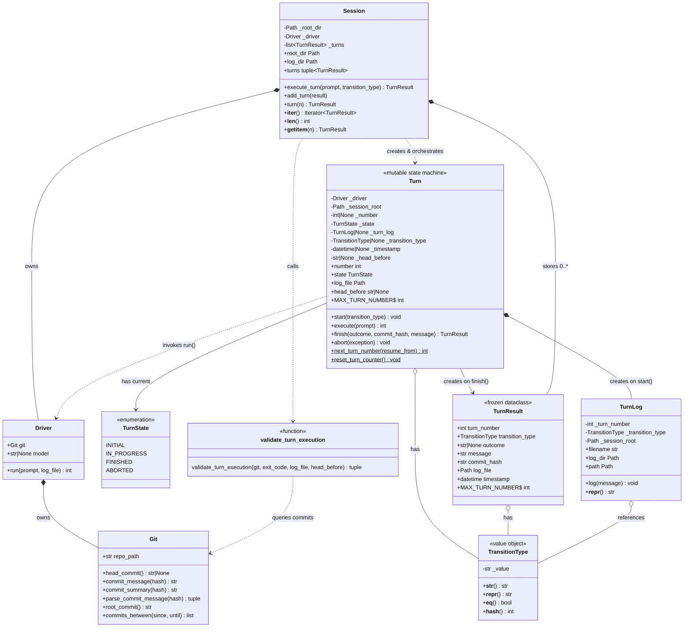

# AFK Domain Model

Generated: 2025-12-14

This diagram shows the core entities of the AFK framework, their attributes, and relationships.

## Class Diagram



## Relationship Legend

| Symbol | Meaning |
|--------|---------|
| `*--` | Composition (owns lifecycle) |
| `o--` | Association (references) |
| `..>` | Dependency (uses/calls) |
| `-->` | Creates (factory relationship) |

## Entity Descriptions

### Core Entities

| Entity | Role | Immutable |
|--------|------|-----------|
| **Git** | Repository operations - queries commits, parses messages | No |
| **Driver** | Executes prompts via Claude Code CLI with script wrapper | No |
| **TurnState** | Enum of Turn lifecycle states: INITIAL, IN_PROGRESS, FINISHED, ABORTED | Yes (enum) |
| **TurnResult** | Complete frozen record of a finished turn - all data needed for history | Yes (frozen) |
| **TransitionType** | Validated state label (e.g., "init", "coding") | Yes (value object) |
| **Turn** | Mutable state machine for active turn execution | No (state machine) |
| **TurnLog** | Manages log file paths and writes turn lifecycle events | No |
| **Session** | Orchestrates turns, owns driver and stores TurnResult history | No |

### Function

| Function | Purpose |
|----------|---------|
| **validate_turn_execution** | Post-execution validation - checks exit code, detects commits, returns result tuple |

## Turn State Machine

```
    +---------+
    | INITIAL |
    +---------+
         |
         | start(transition_type)
         | - captures HEAD
         | - creates TurnLog
         v
    +-------------+
    | IN_PROGRESS |
    +-------------+
         |
    +----+----+
    |         |
    | finish()| abort(exception)
    |         |
    v         v
+----------+ +----------+
| FINISHED | | ABORTED  |
+----------+ +----------+
     |
     +-> returns TurnResult
```

## Lifecycle Flow

```
Session.execute_turn(prompt, transition_type)
    |
    +-> Turn(driver, session_root)     // creates in INITIAL state
    |       |
    |       +-> allocates turn number
    |
    +-> turn.start(transition_type)    // INITIAL -> IN_PROGRESS
    |       |
    |       +-> captures HEAD before
    |       +-> creates TurnLog
    |       +-> logs START marker
    |
    +-> turn.execute(prompt)
    |       |
    |       +-> Driver.run()           // execute prompt
    |       +-> returns exit code
    |
    +-> validate_turn_execution(git, exit_code, log_file, head_before)
    |       |
    |       +-> checks exit code
    |       +-> Git.head_commit()      // after
    |       +-> Git.commits_between()
    |       +-> Git.parse_commit_message()
    |       +-> returns (outcome, commit_hash, message)
    |
    +-> turn.finish(outcome, commit_hash, message) // IN_PROGRESS -> FINISHED
    |       |
    |       +-> logs END marker
    |       +-> returns TurnResult
    |
    +-> Session._add_result(result)    // stores in history
```

### On Error

```
Session.execute_turn(prompt, transition_type)
    |
    +-> Turn(...), start(...), execute(...)
    |
    +-> exception raised
    |
    +-> turn.abort(exception)          // IN_PROGRESS -> ABORTED
            |
            +-> logs ABORT marker with traceback
            +-> re-raises exception
```

## Validation Summary

| Entity | Validates At |
|--------|-------------|
| **TransitionType** | Construction: pattern `^[a-z][a-z0-9_.-]*$` |
| **TurnResult** | Construction: number range 1-99999, types, absolute path, timezone-aware timestamp |
| **Turn** | Construction: Driver type, Path type, absolute path |
| **Turn.start()** | TransitionType type |
| **Turn.execute/finish/abort()** | State is IN_PROGRESS |
| **TurnLog** | Construction: number range, type, Path for session_root |
| **Session** | Construction: absolute directory path, valid Driver |
| **validate_turn_execution** | Runtime: exactly one commit, zero exit code, ancestry path |
