# AFK Domain Model

Generated: 2025-12-13

This diagram shows the core entities of the AFK framework, their attributes, and relationships.

## Class Diagram

```mermaid
classDiagram
    direction TB

    class Git {
        +str repo_path
        +head_commit() str|None
        +commit_message(hash) str
        +commit_summary(hash) str
        +parse_commit_message(hash) tuple
        +root_commit() str
        +commits_between(since, until) list
    }

    class Driver {
        +Git git
        +str|None model
        +run(prompt, log_file) int
    }

    class TurnResult {
        <<frozen dataclass>>
        +str|None outcome
        +str message
        +str commit_hash
    }

    class TransitionType {
        <<value object>>
        -str _value
        +__str__() str
        +__repr__() str
        +__eq__() bool
        +__hash__() int
    }

    class Turn {
        <<frozen dataclass>>
        +int turn_number
        +TransitionType transition_type
        +TurnResult result
        +Path log_file
        +datetime timestamp
        +next_turn_number(resume_from)$ int
        +reset_turn_counter()$
        +MAX_TURN_NUMBER$ int
    }

    class TurnLog {
        -int _turn_number
        -TransitionType _transition_type
        -Path _session_root
        +filename str
        +log_dir Path
        +path Path
    }

    class Session {
        -Path _root_dir
        -Driver _driver
        -list~Turn~ _turns
        +root_dir Path
        +log_dir Path
        +turns tuple~Turn~
        +execute_turn(prompt, type) Turn
        +add_turn(turn)
        +turn(n) Turn
        +__iter__() Iterator~Turn~
        +__len__() int
        +__getitem__(n) Turn
    }

    class execute_turn {
        <<function>>
        execute_turn(driver, prompt, log_file) TurnResult
    }

    %% Composition (ownership)
    Driver *-- Git : owns
    Session *-- Driver : owns
    Session *-- Turn : owns 0..*
    Turn *-- TurnResult : contains

    %% Association (references)
    Turn o-- TransitionType : has
    TurnLog o-- TransitionType : references

    %% Dependencies (uses)
    Session ..> TurnLog : uses for paths
    Session ..> execute_turn : calls
    execute_turn ..> Driver : invokes run()
    execute_turn ..> Git : queries commits
    execute_turn ..> TurnResult : returns
```



## Relationship Legend

| Symbol | Meaning |
|--------|---------|
| `*--` | Composition (owns lifecycle) |
| `o--` | Association (references) |
| `..>` | Dependency (uses/calls) |

## Entity Descriptions

### Core Entities

| Entity | Role | Immutable |
|--------|------|-----------|
| **Git** | Repository operations - queries commits, parses messages | No |
| **Driver** | Executes prompts via Claude Code CLI with script wrapper | No |
| **TurnResult** | Outcome of a single turn - outcome, message, commit hash | Yes (frozen) |
| **TransitionType** | Validated state label (e.g., "init", "coding") | Yes (value object) |
| **Turn** | Complete record of one execution - number, type, result, log | Yes (frozen) |
| **TurnLog** | Generates log file paths from turn number, type, and session root | No |
| **Session** | Orchestrates turns, owns driver and turn history | No |

### Function

| Function | Purpose |
|----------|---------|
| **execute_turn** | Core execution logic - runs driver, detects commits, returns result |

## Lifecycle Flow

```
Session.execute_turn(prompt, type)
    |
    +-> Turn.next_turn_number()        // get next number
    |
    +-> TurnLog(number, type, root)    // determine log path
    |
    +-> execute_turn(driver, prompt, log_file)
    |       |
    |       +-> Git.head_commit()      // before
    |       +-> Driver.run()           // execute
    |       +-> Git.commits_between()
    |       +-> Git.parse_commit_message()
    |       +-> return TurnResult
    |
    +-> Turn(number, type, result, log, timestamp)
            |
            +-> added to Session._turns
```

## Validation Summary

| Entity | Validates At |
|--------|-------------|
| **TransitionType** | Construction: pattern `^[a-z][a-z0-9_.-]*$` |
| **TurnResult** | Construction: types of all fields |
| **Turn** | Construction: number range 1-99999, timezone-aware timestamp, absolute log path |
| **TurnLog** | Construction: number range, type, Path for session_root |
| **Session** | Construction: absolute directory path, valid Driver |
| **execute_turn** | Runtime: exactly one commit, zero exit code, ancestry path |
